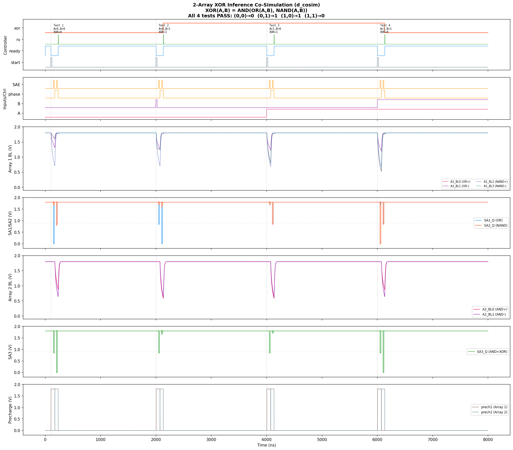
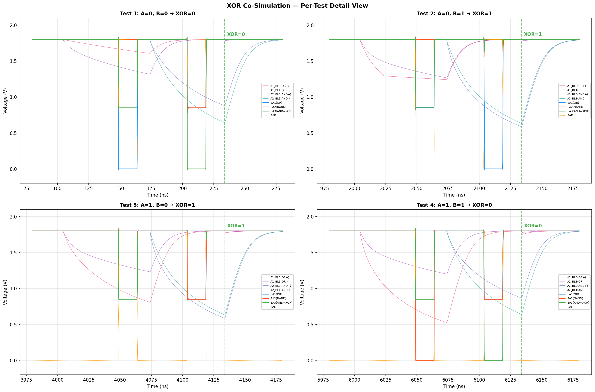

# RRAM Mixed-Signal Co-Simulation (d_cosim)

> **프로젝트**: Sky130 PDK 기반 2-Array RRAM XOR 신경망 inference 칩
> **도구**: ngspice-43 d_cosim + Verilator + OSDI RRAM compact model
> **날짜**: 2026-02-10 ~ 2026-02-19

---

## 요약

이 디렉토리는 **RRAM 크로스바 어레이 기반 XOR 신경망의 post-layout mixed-signal co-simulation** 결과를 포함합니다.

| 시뮬레이션 | 날짜 | 결과 | 파일 |
|-----------|------|------|------|
| **2-Array XOR Inference** | 2026-02-19 | **4/4 PASS** ✅ | `xor_cosim.spice` |
| Single-Array READ/WRITE | 2026-02-10~11 | READ+WRITE 성공 ✅ | `rram_cosim_full_v3.spice` |
| Post-Layout vs Schematic 비교 | 2026-02-18 | 일치 확인 ✅ | `rram_cosim_postlayout.spice` |

> **참고**: 모든 아날로그 블록은 layout-extracted 넷리스트를 사용합니다 (post-layout simulation). Post-layout 검증 결과 정리는 [`../postsim/README.md`](../postsim/README.md)도 참조하세요.

### XOR Truth Table 검증 결과

```
  Test   A   B   OR  NAND  AND  Expected  Got   Status
------------------------------------------------------------
     1   0   0    0     1    0         0    0     PASS
     2   0   1    1     1    1         1    1     PASS
     3   1   0    1     1    1         1    1     PASS
     4   1   1    1     0    0         0    0     PASS
------------------------------------------------------------
  ALL 4 TESTS PASSED — XOR inference verified!
```

**XOR 파형 (전체):**



**XOR 파형 (테스트별 상세):**



---

## 1. d_cosim이란?

`d_cosim`은 ngspice의 XSPICE 확장 기능으로, **Verilog로 작성된 디지털 회로를 SPICE 아날로그 시뮬레이션 안에서 직접 실행**할 수 있게 해줍니다.

일반적인 mixed-signal 시뮬레이션은 상용 도구(Cadence AMS, Mentor Questa 등)가 필요하지만, d_cosim을 사용하면 **오픈소스만으로** Verilog FSM ↔ 아날로그 RRAM closed-loop 시뮬레이션이 가능합니다.

### 빌드 체인

```
Verilog RTL ──[vlnggen]──▶ .so (Verilator 컴파일) ──[d_cosim]──▶ ngspice 시뮬레이션
```

**vlnggen** 내부 동작:
1. `verilator`로 Verilog → C++ 변환
2. `verilator_shim.cpp`로 d_cosim 인터페이스 래핑
3. `g++ -shared -fpic`으로 공유 라이브러리(`.so`) 생성

---

## 2. 2-Array XOR Inference Co-Simulation

### 2.1 XOR 아키텍처

XOR은 단일 RRAM 어레이로 구현 불가능 (비선형 함수). 2-레이어로 분해하여 2개 어레이를 사용합니다:

```
XOR(A, B) = AND( OR(A,B), NAND(A,B) )

Phase 0 (Layer 1): Array 1 활성
  SL1 = {1, 1, B, A}
  SA1(BL[0] vs BL[1]) → h1 (OR)
  SA2(BL[2] vs BL[3]) → h2 (NAND)

Phase 1 (Layer 2): Array 2 활성
  SL2 = {1, 1, h2, h1}
  SA3(BL[0] vs BL[1]) → xor_result (AND)
```

### 2.2 시뮬레이션 구조

```
┌──────────────────────────────────────────────────────────────────┐
│                      ngspice 시뮬레이션                            │
│                                                                  │
│  [Stimulus: start, A, B]                                         │
│         │                                                        │
│         ▼ ADC Bridge                                             │
│  ┌──────────────────────────────────────────────┐                │
│  │  d_cosim (xor_cosim_top.so, Verilator)       │                │
│  │  ├─ xor_controller.v  (2-phase XOR FSM)      │                │
│  │  ├─ input_encoder.v   (SL 생성)               │                │
│  │  ├─ sae_control.v     (SA enable 타이밍)       │                │
│  │  └─ SA output latching (precharge 보호)        │ ◀── SA 피드백  │
│  └──────────┬───────────────────────────────────┘                │
│             │ DAC Bridge (wl_en, sae, sl_data, phase)            │
│             ▼                                                    │
│  ┌──────────────────────┐  ┌──────────────────────┐              │
│  │    ARRAY 1 (OR+NAND) │  │    ARRAY 2 (AND)     │              │
│  │  ┌────────────────┐  │  │  ┌────────────────┐  │              │
│  │  │ WL Driver ×4   │  │  │  │ WL Driver ×4   │  │              │
│  │  │ (post-layout)  │  │  │  │ (post-layout)  │  │              │
│  │  └───────┬────────┘  │  │  └───────┬────────┘  │              │
│  │          ▼           │  │          ▼           │              │
│  │  ┌────────────────┐  │  │  ┌────────────────┐  │              │
│  │  │ RRAM 4x4 Array │  │  │  │ RRAM 4x4 Array │  │              │
│  │  │ (OSDI model)   │  │  │  │ (OSDI model)   │  │              │
│  │  └───────┬────────┘  │  │  └───────┬────────┘  │              │
│  │          ▼           │  │          ▼           │              │
│  │  ┌────────────────┐  │  │  ┌────────────────┐  │              │
│  │  │ SA1(OR) SA2(ND)│  │  │  │ SA3 (AND=XOR)  │  │              │
│  │  │ (post-layout)  │  │  │  │ (post-layout)  │  │              │
│  │  └───────┬────────┘  │  │  └───────┬────────┘  │              │
│  └──────────┼───────────┘  └──────────┼───────────┘              │
│             └──────────────┬──────────┘                          │
│                            ▼ ADC Bridge                          │
│                    SA outputs → d_cosim (closed loop)             │
└──────────────────────────────────────────────────────────────────┘
```

**Post-layout 구성:**

| 블록 | 추출 방식 | 증거 |
|------|-----------|------|
| WL Driver ×8 | **layout-extracted** (Magic ext2spice) | 내부 노드 `a_423_138#`, `a_342_589#` |
| Sense Amp ×3 | **layout-extracted** (Magic ext2spice) | 내부 노드 `a_15_458#`, `a_273_458#` |
| BL Write Driver ×8 | **layout-extracted** (Magic ext2spice) | 내부 노드 `a_186_658#`, `a_291_609#` |
| RRAM 1T1R ×32 | OSDI compact model (PDK) | `sky130_fd_pr_reram__reram_module.osdi` |
| XOR Controller | Verilator d_cosim (.so) | `xor_cosim_top.so` |

`a_XXX_YYY#` 노드명은 Magic이 layout 좌표 기반으로 자동 생성하는 이름입니다.

### 2.3 RRAM Weight Matrix

**Array 1 — OR + NAND (Phase 0):**

```
SL = {1, 1, B, A} → Row0=A, Row1=B, Row2=bias, Row3=zero

            BL[0]      BL[1]      BL[2]       BL[3]
            OR(+)      OR(-)      NAND(+)     NAND(-)
Row 0 (A):  LRS(4.5)   HRS(3.5)   HRS(3.5)    LRS(4.5)
Row 1 (B):  LRS(4.5)   HRS(3.5)   HRS(3.5)    LRS(4.5)
Row 2 (bias):HRS(3.5)  mLRS(4.0)  sLRS(4.6)   HRS(3.5)
Row 3 (zero):HRS(3.5)  HRS(3.5)   HRS(3.5)    HRS(3.5)

(괄호 안 숫자 = Tfilament_0 in nm)
```

**Array 2 — AND (Phase 1):**

```
SL = {1, 1, h2, h1} → Row0=h1, Row1=h2, Row2=bias, Row3=zero

            BL[0]      BL[1]
            AND(+)     AND(-)
Row 0 (h1): LRS(4.5)   HRS(3.5)
Row 1 (h2): LRS(4.5)   HRS(3.5)
Row 2 (bias):HRS(3.5)  sLRS2(4.7)  ← Array 1의 sLRS(4.6)보다 강함
Row 3 (zero):HRS(3.5)  HRS(3.5)

sLRS2 = 4.7nm (Array 2 전용, SA metastability 해결용)
```

### 2.4 RRAM 저항 레벨

| 레벨 | Tfilament_0 | 대략적 저항 | 용도 |
|------|------------|-----------|------|
| HRS | 3.5 nm | ~286 kΩ | 0 (off) weight |
| mLRS | 4.0 nm | ~50 kΩ | OR negative bias |
| LRS | 4.5 nm | ~34 kΩ | 1 (on) weight |
| sLRS | 4.6 nm | ~27 kΩ | NAND negative bias (Array 1) |
| sLRS2 | 4.7 nm | ~21 kΩ | AND negative bias (Array 2) |

### 2.5 핵심 시뮬레이션 파라미터

| 파라미터 | 값 | 이유 |
|---------|-----|------|
| Clock | 200 MHz (5ns period) | BL 과방전 방지 |
| BL Capacitance | 5 pF | SA 입력이 Vth(~0.6V) 이상 유지 |
| SAE Width | 3 cycles (15ns) | SA resolution 충분 |
| OSDI Tfilament_min | 3.4 nm | HRS(3.5) 경계 segfault 방지 |
| ADC thresholds | in_low=0.6V, in_high=1.2V | 아날로그→디지털 변환 |
| Convergence | reltol=5e-3, method=gear | RRAM OSDI 수렴성 |
| Per-array precharge | XSPICE d_and/d_inverter | 비활성 어레이 BL 보호 |

### 2.6 SA Output Latching

StrongARM SA는 SAE=0이면 precharge 상태로 돌아가 Q=QB=VDD가 됩니다. FSM은 SAE가 끝난 후 LATCH 상태에서 SA를 읽으므로, 항상 precharge 값(VDD)만 읽게 됩니다.

**해결**: `xor_cosim_top.v` wrapper에서 SAE가 HIGH인 동안 SA 출력을 레지스터로 래칭:

```verilog
always @(posedge clk or negedge rst_n) begin
    if (!rst_n) begin
        sa1_latched <= 1'b0;
    end else if (sae_int) begin   // SAE가 HIGH일 때만 갱신
        sa1_latched <= sa1_q;     // SA 결과를 캡처
    end
end
// Controller는 sa1_latched를 읽음 (precharge 후에도 값 유지)
```

### 2.7 Per-Array Precharge Control

2-phase 구조에서는 Phase 0 동안 Array 2의 BL이 불필요하게 방전됩니다 (WL이 공유되므로). 이를 방지하기 위해 per-array precharge 제어를 추가:

```
Array 1: precharge OFF = wl_on AND NOT phase  (Phase 0에서만 방전)
Array 2: precharge OFF = wl_on AND phase      (Phase 1에서만 방전)
```

XSPICE `d_and`, `d_inverter` 게이트로 구현합니다.

---

## 3. 실행 방법

### 3.1 환경 요구사항

| 도구 | 버전 | 경로 |
|------|------|------|
| ngspice | **43** (d_cosim + KLU) | `$NGSPICE` |
| Verilator | **5.020+** | `/usr/bin/verilator` |
| Sky130 PDK | bdc9412b (RRAM 포함) | `$PDK_ROOT/sky130B/` |
| Python 3 | + numpy, matplotlib | 플롯 생성용 |

> **주의**: 시스템 기본 ngspice(apt)는 d_cosim을 지원하지 않습니다. 반드시 `$NGSPICE_HOME/` 의 소스 빌드 ngspice-43을 사용해야 합니다.

### 3.2 XOR Co-Simulation 실행 (원클릭)

```bash
cd $PROJECT_ROOT/analog/sim/cosim
./run_xor_cosim.sh
```

이 스크립트가 순서대로 실행합니다:
1. Verilog RTL → `xor_cosim_top.so` 컴파일 (vlnggen)
2. ngspice 시뮬레이션 (`xor_cosim.spice`, ~3분 소요)
3. 결과 플롯 생성 (`plot_xor_cosim.py`)

**옵션:**
```bash
./run_xor_cosim.sh          # 전체 실행 (컴파일 + 시뮬레이션 + 플롯)
./run_xor_cosim.sh --sim    # 컴파일 건너뛰기 (시뮬레이션 + 플롯)
./run_xor_cosim.sh --plot   # 플롯만 재생성
```

### 3.3 수동 실행 (단계별)

**Step 1: Verilog → .so 컴파일**

```bash
cd $PROJECT_ROOT/analog/sim/cosim/verilog

# vlnggen은 반드시 ngspice를 통해 실행 (-- separator 필수)
$NGSPICE -- \
  $VLNGGEN \
  -Wno-CASEINCOMPLETE \
  xor_cosim_top.v \
  $PROJECT_ROOT/openlane/src/xor_controller.v \
  $PROJECT_ROOT/openlane/src/input_encoder.v \
  $PROJECT_ROOT/openlane/src/sae_control.v

# 결과: xor_cosim_top.so 생성
```

> **주의**: vlnggen 경로를 직접 실행하면 `-Wno-CASEINCOMPLETE`이 ngspice 옵션으로 파싱되어 실패합니다. 반드시 `ngspice -- vlnggen` 형태로 실행해야 합니다.

**Step 2: 시뮬레이션 실행**

```bash
cd $PROJECT_ROOT/analog/sim/cosim
$NGSPICE -b xor_cosim.spice
```

**Step 3: 결과 확인**

```bash
# 로그에서 측정값 확인
grep -E "Test|xr[1-4]" xor_cosim.log

# 플롯 생성
python3 plot_xor_cosim.py

# 상세 분석 (선택)
python3 debug_xor3.py
```

---

## 4. 파일 구조

```
$PROJECT_ROOT/analog/sim/cosim/
│
├── README.md                          ← 이 문서
│
├── ★ XOR Co-Simulation (2-Array, 2026-02-19) ★
│   ├── xor_cosim.spice                ← 2-Array XOR 테스트벤치 (481줄)
│   ├── run_xor_cosim.sh               ← 원클릭 실행 스크립트
│   ├── plot_xor_cosim.py              ← 결과 시각화 (7-panel + 4-panel)
│   ├── xor_cosim_full.png             ← 결과: 전체 파형 (8µs)
│   ├── xor_cosim_detail.png           ← 결과: 테스트별 확대 파형
│   ├── xor_cosim.log                  ← 시뮬레이션 로그 + 측정값
│   └── xor_cosim.csv                  ← 원시 파형 데이터 (wrdata)
│
├── verilog/                           ← Verilog RTL + 컴파일 결과
│   ├── xor_cosim_top.v                ← d_cosim wrapper (SA latching 포함)
│   ├── xor_cosim_top.so               ← 컴파일된 공유 라이브러리
│   ├── xor_cosim_top_obj_dir/         ← Verilator 빌드 디렉토리
│   ├── controller.v                   ← 단일 어레이 FSM (이전 버전)
│   ├── controller.so                  ← 컴파일된 .so (이전 버전)
│   └── controller_cosim.v             ← 단일 어레이 wrapper (이전 버전)
│
├── ★ RTL 소스 (참조, 원본은 openlane/src/) ★
│   ├── → xor_controller.v             ← 2-phase XOR FSM (147줄)
│   ├── → input_encoder.v              ← Phase별 SL 생성 (35줄)
│   └── → sae_control.v                ← SAE pulse generator (51줄)
│
├── ★ Single-Array Co-Simulation (2026-02-10~11) ★
│   ├── rram_cosim_full_v3.spice       ← 최종 성공 (50µs WRITE, VREF=0.93V)
│   ├── rram_cosim_full.png            ← v1 결과 파형
│   ├── plot_cosim_full.py             ← v1 플롯 스크립트
│   ├── run_cosim.sh                   ← 단일 어레이 실행 스크립트
│   ├── rram_cosim_full.spice          ← v1 (80ns WRITE)
│   ├── rram_cosim_full_v2.spice       ← v2 (5µs WRITE)
│   └── d_cosim_full.spice             ← 기본 테스트
│
├── ★ Post-Layout Comparison (2026-02-18) ★
│   ├── rram_cosim_postlayout.spice    ← post-layout 넷리스트 사용
│   ├── rram_cosim_postlayout.png      ← 결과 파형
│   ├── compare_sch_vs_postlayout.py   ← schematic vs post-layout 비교
│   └── compare_sch_vs_postlayout.png  ← 비교 결과 이미지
│   └── (→ post-layout 결과 정리: ../postsim/README.md 참조)
│
├── ★ Debug Scripts ★
│   ├── debug_xor.py                   ← XOR 디버그: 고정 시간 신호값
│   ├── debug_xor2.py                  ← XOR 디버그: SAE 윈도우 BL 분석
│   ├── debug_xor3.py                  ← XOR 디버그: 4-test 종합 분석
│   └── debug_sa3.py                   ← SA3 partial resolution 디버그
│
└── (기타 이전 테스트/디버그 파일들)
```

### RTL 소스 파일 위치

XOR co-sim에서 사용하는 RTL 소스는 OpenLane 빌드와 동일한 파일입니다:

```
$PROJECT_ROOT/openlane/src/
├── xor_controller.v     ← 2-phase XOR FSM
├── input_encoder.v      ← Phase별 SL 데이터 생성
└── sae_control.v        ← SAE pulse (3-cycle width)
```

---

## 5. 디버깅 히스토리 (XOR Co-Sim)

XOR co-simulation은 여러 문제를 순차적으로 해결하며 완성되었습니다:

### 5.1 OSDI Segfault (Tfilament 경계)

**문제**: HRS Tfilament_0=3.3e-9가 Tfilament_min=3.3e-9과 같아서 OSDI 모델이 경계에서 crash.
**해결**: HRS를 3.5e-9로, Tfilament_min을 3.4e-9로 변경.

### 5.2 SA Precharge 손실

**문제**: StrongARM SA는 SAE=0이면 Q=QB=VDD (precharge). FSM이 LATCH state에서 읽을 때 SAE는 이미 0 → 항상 VDD 읽음.
**해결**: `xor_cosim_top.v`에 SA output latching register 추가. SAE HIGH 동안만 값을 캡처.

### 5.3 BL 과방전

**문제**: 100fF BL cap + 50MHz clock → BL이 SAE 전에 0V 근처까지 방전. SA 입력 NMOS(Vth~0.4V) 미동작.
**해결**: Clock 200MHz + BL cap 5pF. BL이 ~1.0V 유지하면서 충분한 differential 확보.

### 5.4 Array 2 BL 방전 (Inter-array Crosstalk)

**문제**: WL이 두 어레이에 공유되므로, Phase 0에서 Array 2의 BL도 방전됨.
**해결**: Per-array precharge control 추가. XSPICE `d_and`/`d_inverter`로 각 어레이의 precharge를 독립 제어.

### 5.5 AND Bias 최적화 (SA Metastability)

**문제**: sLRS=4.6에서 Test 4 PASS, Test 1 FAIL (SA3 metastable at 0.86V). sLRS=4.55에서 반대.
**근본 원인**: SA3의 layout parasitic 비대칭 → 특정 방향에서 metastability 발생.
**해결**: Array 2 AND bias를 독립 값(sLRS2=4.7)으로 분리. 1-input differential 200mV 확보 → 안정적 resolution.

| sLRS 값 | Test 1 | Test 2 | Test 3 | Test 4 | 비고 |
|---------|--------|--------|--------|--------|------|
| 4.55 | PASS | PASS | PASS | FAIL | AND margin 45mV (부족) |
| 4.6 | FAIL | PASS | PASS | PASS | SA3 metastable 0.86V |
| **4.7** | **PASS** | **PASS** | **PASS** | **PASS** | **1-input diff 200mV** |
| 4.8 | PASS | FAIL | FAIL | PASS | AND bias 과도 (2-input 역전) |

### 5.6 verilator_shim.cpp 버그 (2026-02-10)

ngspice 기본 제공 shim에 2개 버그 수정:
1. **VerilatedContext use-after-free**: 로컬 변수 → `static`으로 변경
2. **Multi-bit input clear**: `~` 연산자 누락으로 상위 비트 클리어 안 됨

---

## 6. Single-Array Co-Simulation (이전 작업)

### 테스트 시나리오

단일 RRAM 4x4 어레이에 대한 READ → WRITE(SET) → READ 검증:

```
[Phase 1: READ]     [Phase 2: WRITE (50µs)]           [Phase 3: READ]
   HRS 확인            3.0V BL, 50µs SET pulse           SET 확인
   rd=0 ✓              filament: 3.5nm → ~3.8nm          rd=1 ✅
```

### 진화 과정

| 버전 | WRITE 시간 | VWRITE | VREF | 결과 |
|:---:|:---:|:---:|:---:|:---:|
| v1 | 80ns | 1.8V | 0.9V | SET 안 됨 |
| v2 | 5µs | 3.0V | 0.9V | SET 부족 |
| **v3** | **50µs** | **3.0V** | **0.93V** | **성공** ✅ |

### 실행 방법

```bash
cd $PROJECT_ROOT/analog/sim/cosim
$NGSPICE -b rram_cosim_full_v3.spice
python3 plot_cosim_full.py
```

---

## 7. 핵심 교훈

### RRAM 물리 모델
1. **OSDI 모델은 보수적**: Eact_generation=1.501eV → SET에 50µs+ 필요
2. **Tfilament 경계 주의**: Tfilament_0 = Tfilament_min → segfault. 여유 필요
3. **다중 저항 레벨**: HRS/mLRS/LRS/sLRS로 차동 weight 프로그래밍

### SA (Sense Amplifier)
4. **StrongARM precharge**: SAE=0 → Q=QB=VDD. d_cosim에서 반드시 출력 래칭 필요
5. **Layout parasitic 비대칭**: 동일 differential에서도 방향에 따라 metastability 발생 가능
6. **SA polarity**: INP > INN → Q=LOW (0V), INP < INN → Q=HIGH (1.8V)

### 2-Array 구조
7. **Per-array precharge 필수**: WL 공유 시 비활성 어레이 BL 방전 방지
8. **Array별 bias 분리**: AND/NAND bias를 독립 tuning하면 margin 확보 용이
9. **BL cap 크기**: 방전 속도 vs SA 입력 전압 트레이드오프. 5pF이 최적

### d_cosim
10. **vlnggen 실행**: `ngspice -- /path/to/vlnggen` (-- separator 필수)
11. **포트 매핑**: per-bit, MSB first, inout은 `null`
12. **verilator_shim 버그**: use-after-free + bitwise 버그 → 직접 수정 필요
