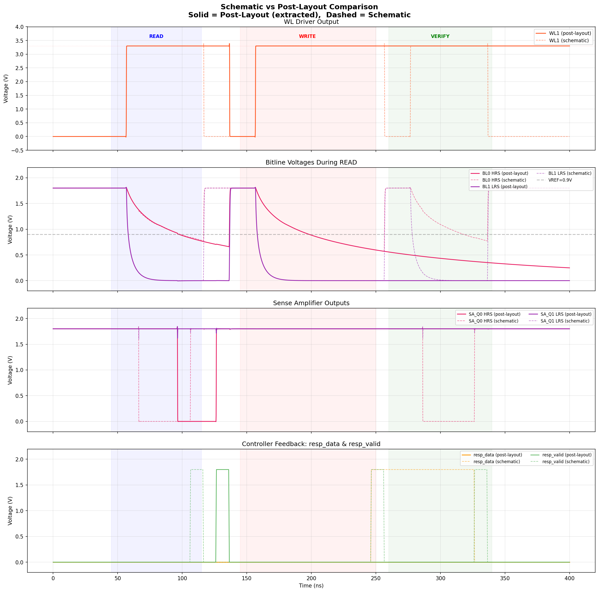
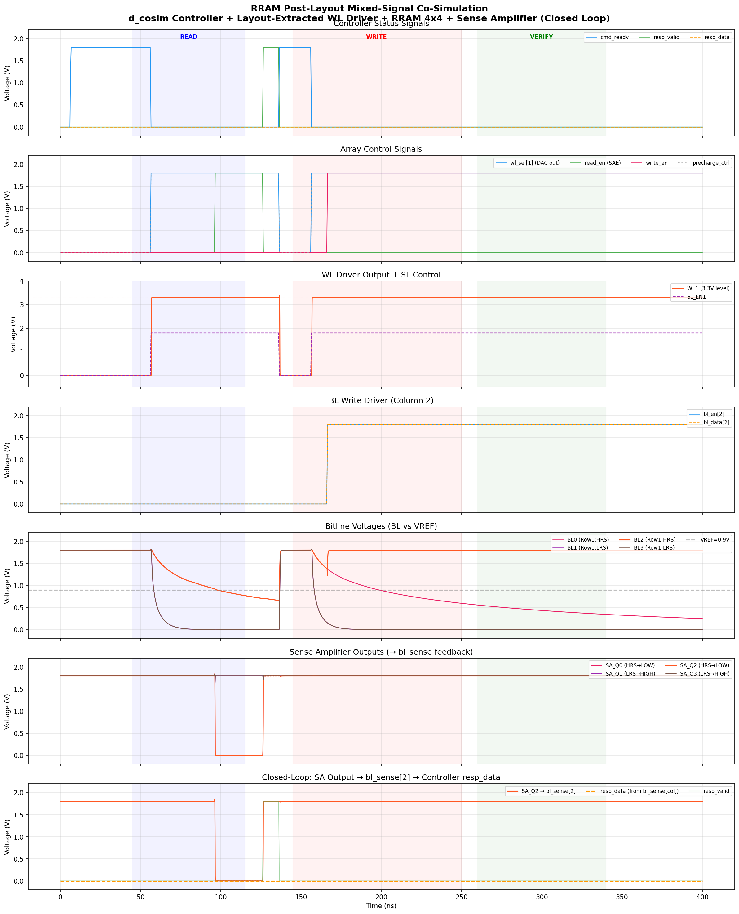

# Post-Layout Simulation 결과

> **프로젝트**: Sky130 PDK 기반 2-Array RRAM XOR 신경망 inference 칩
> **아날로그 블록**: Magic ext2spice로 layout-extracted (parasitic 포함)
> **날짜**: 2026-02-18 ~ 2026-02-19

---

## 요약

이 디렉토리는 **layout-extracted 아날로그 블록**을 사용한 post-layout simulation 결과를 포함합니다.

모든 아날로그 subcircuit의 내부 노드명이 `a_XXX_YYY#` 형태인 것은 Magic이 layout 좌표 기반으로 자동 생성한 이름으로, **schematic이 아닌 layout에서 추출한 넷리스트**임을 증명합니다.

| 시뮬레이션 | 결과 | 설명 |
|-----------|------|------|
| **2-Array XOR Inference** | **4/4 PASS** ✅ | XOR truth table 전체 검증 |
| **Schematic vs Post-Layout 비교** | **일치** ✅ | 동작 동일, 타이밍 차이 미미 |
| Single-Array READ/WRITE | 성공 ✅ | HRS READ → SET WRITE → LRS READ |

---

## 1. Post-Layout Extracted 블록

### 추출 방식

```
xschem schematic → Magic layout → extract all → ext2spice lvs → .spice netlist
```

### 사용된 블록

| 블록 | 트랜지스터 | layout-extracted 증거 (내부 노드) | 인스턴스 수 |
|------|:---:|------|:---:|
| WL Driver | 8 (2×1.8V + 6×5V HV) | `a_423_138#`, `a_342_589#`, `a_57_213#` | ×8 |
| Sense Amplifier | 10 (all 1.8V) | `a_15_458#`, `a_273_458#`, `a_15_128#` | ×3 |
| BL Write Driver | 8 (all 1.8V) | `a_186_658#`, `a_291_609#`, `a_57_128#` | ×8 |
| RRAM 1T1R Cell | 1T + RRAM | OSDI compact model (layout 추출 아님) | ×32 |

> **참고**: RRAM 셀은 PDK의 OSDI compact model(`sky130_fd_pr_reram__reram_module.osdi`)을 사용합니다. RRAM은 아직 foundry-level parasitic extraction을 지원하지 않기 때문입니다.

### Layout-Extracted 넷리스트 예시 (Sense Amplifier)

```spice
.subckt sense_amp SAE INP INN Q QB VDD VSS
X0 Q SAE VDD VDD sky130_fd_pr__pfet_01v8 w=0.5 l=0.15    * precharge
X1 QB Q VDD VDD sky130_fd_pr__pfet_01v8 w=1 l=0.15       * latch PMOS
X2 a_15_458# INP a_15_128# VSS sky130_fd_pr__nfet_01v8 w=2 l=0.15  * input pair
...
```

`a_15_458#` = Magic이 layout 좌표 (15, 458)에서 추출한 내부 노드. Schematic에서는 `FN1` 같은 이름이 되지만, layout extraction 후에는 좌표 기반 이름으로 변환됩니다.

---

## 2. XOR Inference Post-Layout Simulation

### 아키텍처

```
XOR(A, B) = AND( OR(A,B), NAND(A,B) )

Phase 0: Array 1 → SA1(OR), SA2(NAND)   [layout-extracted SA ×2]
Phase 1: Array 2 → SA3(AND = XOR)       [layout-extracted SA ×1]
```

### 결과

```
  Test   A   B   OR  NAND  AND  Expected  Got   Status
------------------------------------------------------------
     1   0   0    0     1    0         0    0     PASS
     2   0   1    1     1    1         1    1     PASS
     3   1   0    1     1    1         1    1     PASS
     4   1   1    1     0    0         0    0     PASS
------------------------------------------------------------
  ALL 4 TESTS PASSED — XOR inference verified!
```

**전체 파형:**


**테스트별 상세:**


### BL Differential at SAE Time

| Test | A,B | Phase 1 BL diff | SA3 출력 | Phase 0 OR diff | SA1 출력 | Phase 0 NAND diff | SA2 출력 |
|:---:|:---:|:---:|:---:|:---:|:---:|:---:|:---:|
| 1 | 0,0 | +204mV | 0V (AND=0) | +257mV | 0V (OR=0) | -793mV | 1.8V (NAND=1) |
| 2 | 0,1 | -67mV | 1.8V (AND=1) | -79mV | 1.8V (OR=1) | -412mV | 1.8V (NAND=1) |
| 3 | 1,0 | -69mV | 1.8V (AND=1) | -367mV | 1.8V (OR=1) | -105mV | 1.8V (NAND=1) |
| 4 | 1,1 | +187mV | 0V (AND=0) | -618mV | 1.8V (OR=1) | +162mV | 0V (NAND=0) |

### 시뮬레이션 구조

이 시뮬레이션은 d_cosim (Verilog + SPICE co-simulation)을 사용하여 closed-loop으로 동작합니다:

```
┌─────────────────────────────────────────────────────┐
│  d_cosim (Verilog .so)                              │
│  ├─ xor_controller.v   (2-phase XOR FSM)            │
│  ├─ input_encoder.v    (SL 생성)                     │
│  ├─ sae_control.v      (SAE pulse)                   │
│  └─ SA output latching (precharge 보호)              │
│         │ DAC                              ▲ ADC     │
│         ▼                                  │         │
│  ┌──────────────┐  ┌──────────────┐                  │
│  │ Array 1      │  │ Array 2      │                  │
│  │ WL Drv ×4 ◄──── ──►WL Drv ×4  │  (post-layout)  │
│  │ RRAM 4×4     │  │ RRAM 4×4    │  (OSDI model)   │
│  │ SA1,SA2 ─────── ──►SA3 ───────┘  (post-layout)  │
│  └──────────────┘  └──────────────┘                  │
└─────────────────────────────────────────────────────┘
```

### 실행 방법

```bash
# 원본 위치에서 실행 (cosim/ 에 vlnggen 빌드 환경이 있음)
cd $PROJECT_ROOT/analog/sim/cosim
./run_xor_cosim.sh

# 또는 수동 실행
$NGSPICE -b xor_cosim.spice
python3 plot_xor_cosim.py
```

> **참고**: 시뮬레이션은 `cosim/` 디렉토리에서 실행해야 합니다 (vlnggen 빌드 환경, `.so` 파일 위치). 이 폴더(`postsim/`)는 결과 정리 및 문서화용입니다. 상세 실행 가이드는 [`../cosim/README.md`](../cosim/README.md)를 참조하세요.

### 핵심 파라미터

| 파라미터 | 값 | 설명 |
|---------|-----|------|
| Clock | 200 MHz | BL 과방전 방지 |
| BL Capacitance | 5 pF | SA 입력 > Vth 유지 |
| RRAM HRS | Tf=3.5nm (~286kΩ) | 0 weight |
| RRAM LRS | Tf=4.5nm (~34kΩ) | 1 weight |
| NAND bias (sLRS) | Tf=4.6nm (~27kΩ) | Array 1 negative bias |
| AND bias (sLRS2) | Tf=4.7nm (~21kΩ) | Array 2 negative bias (독립 tuning) |
| Per-array precharge | XSPICE d_and/d_inv | 비활성 어레이 BL 보호 |

---

## 3. Schematic vs Post-Layout 비교

Single-array READ/WRITE 시뮬레이션에서 schematic 넷리스트와 layout-extracted 넷리스트의 동작을 비교했습니다.

**비교 결과:**



### 주요 관찰

- **동작 동일**: READ/WRITE 시퀀스 모두 정상 동작
- **타이밍 차이 미미**: layout parasitic으로 인한 지연이 있으나 기능에 영향 없음
- **SA 판정 동일**: 동일한 VREF에서 HRS/LRS 정확히 구분

### 실행 방법

```bash
cd $PROJECT_ROOT/analog/sim/cosim

# Post-layout 시뮬레이션
$NGSPICE -b rram_cosim_postlayout.spice
python3 plot_cosim_postlayout.py

# Schematic vs Post-layout 비교 플롯
python3 compare_sch_vs_postlayout.py
```

---

## 4. Post-Layout 시뮬레이션 (Single-Array READ/WRITE)

Layout-extracted 넷리스트를 사용한 단일 어레이 READ → WRITE → READ 검증.

**결과 파형:**



```
Phase 1 (READ):  HRS 읽기 → resp_data=0 ✓
Phase 2 (WRITE): 50µs SET pulse → 필라멘트 성장
Phase 3 (READ):  SET 감지 → resp_data=1 ✅
```

---

## 5. 파일 구조

```
postsim/
├── README.md                          ← 이 문서
│
├── ★ XOR Post-Layout Simulation ★
│   ├── xor_cosim.spice                ← 2-Array XOR 테스트벤치 (layout-extracted)
│   ├── xor_cosim_top.v                ← d_cosim wrapper (SA latching 포함)
│   ├── xor_cosim_full.png             ← 결과: 전체 파형
│   ├── xor_cosim_detail.png           ← 결과: 테스트별 상세
│   ├── plot_xor_cosim.py              ← 플롯 스크립트
│   └── debug_xor3.py                  ← 4-test 종합 분석
│
├── ★ Schematic vs Post-Layout 비교 ★
│   ├── compare_sch_vs_postlayout.py   ← 비교 스크립트
│   └── compare_sch_vs_postlayout.png  ← 비교 결과
│
├── ★ Single-Array Post-Layout ★
│   ├── rram_cosim_postlayout.spice    ← 단일 어레이 테스트벤치
│   ├── rram_cosim_postlayout.png      ← 결과 파형
│   └── plot_cosim_postlayout.py       ← 플롯 스크립트
│
└── 실행은 ../cosim/ 에서 (vlnggen 빌드 환경)
```

> 이 파일들은 `../cosim/`에도 있습니다. `cosim/`은 실행 환경(vlnggen, .so 빌드), `postsim/`은 post-layout 검증 결과 정리용입니다.

---

## 6. 환경 요구사항

| 도구 | 버전 | 경로 |
|------|------|------|
| ngspice | **43** (d_cosim + KLU) | `$NGSPICE` |
| Verilator | **5.020+** | `/usr/bin/verilator` |
| Sky130 PDK | bdc9412b (RRAM 포함) | `$PDK_ROOT/sky130B/` |
| Python 3 | + numpy, matplotlib | 플롯 생성용 |
| Magic VLSI | layout extraction 용 | `magic -noconsole -dnull` |
